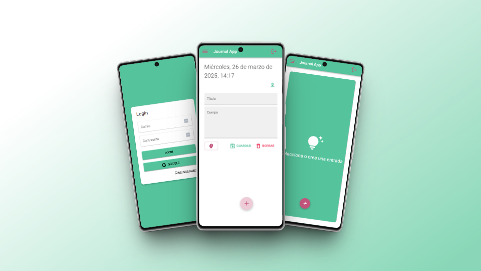
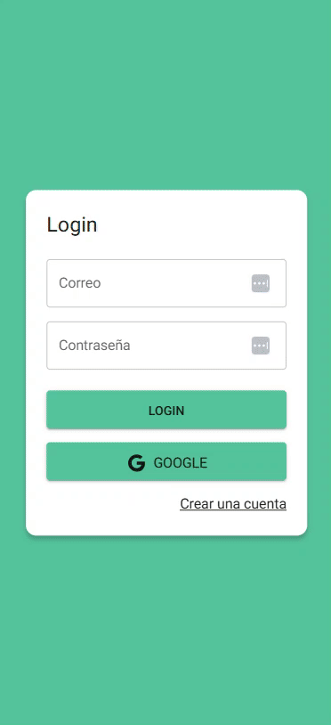

# 📝 Journal-APP — Your Emotional Intelligence Journal

A web application that helps you write your personal journal while analyzing how you talk to yourself. It uses artificial intelligence to detect the emotional tone of your entries and promotes self-awareness.  
Fully responsive and installable as a PWA 📱💬✨

---

## 🚀 Live Demo

🔗 [https://react-cursos-21bad.firebaseapp.com](https://react-cursos-21bad.firebaseapp.com)  
*(Installable from your browser)*

---

## ✨ Features

- 🧠 **Sentiment analysis** using Google Gemini (AI).
- 🔐 Authentication with Firebase (Email and Google).
- 🖼️ Image uploading via Cloudinary.
- 📅 Filter entries by day with calendar.
- 📈 Emotional statistics panel (coming soon).
- 💾 Persistent storage with Firestore.
- 📱 Works as a PWA (offline + installable).

---

## 🎬 Demo



---

## ⚙️ Tech Stack

- **React** + **Redux Toolkit**
- **Material UI (MUI)**
- **Firebase Auth** + **Firestore**
- **Cloudinary** (for image storage)
- **Google Gemini API** (AI-based sentiment analysis)
- **Vite** as build tool
- **PWA** with `vite-plugin-pwa`
- **Cloudflare Workers** to protect the API key

---

## 📦 Local Setup

```bash
git clone https://github.com/BbeatrizSI/Journal-APP.git
cd Journal-APP
npm install
npm run dev
```

---

## 📱 PWA Installation

You can install this application on your phone or computer directly from the browser:

1. In Chrome, click the install icon (📲) in the address bar.
2. Done! It will look and behave like a native app.

---

## 🤝 Contributing

Contributions are welcome!  
Feel free to open a PR or an issue.

> For major changes, please open an issue first to discuss what you would like to improve.

---

## 📄 License

MIT © [Bárbara Beatriz Sacristán Ibáñez](https://github.com/bbeatrizsi)